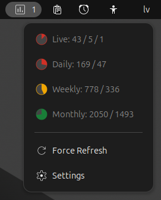
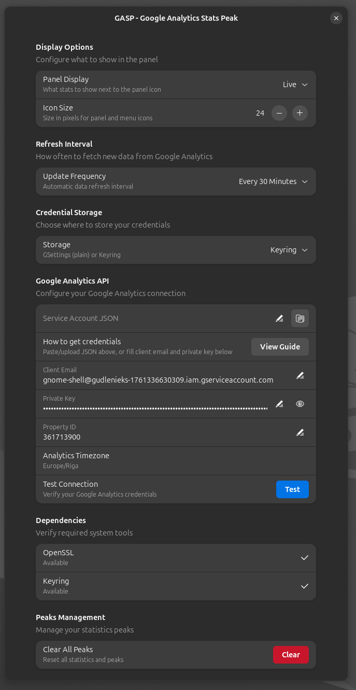

# GASP - Google Analytics Stats Peak

GASP is a GNOME Shell extension that shows your Google Analytics visitor stats in the top dropdown panel and notifies you when you hit new peaks.

## Dropdown Menu Example


# Settings Example



## What You Get

- Panel stats for `Live`, `Daily`, `Weekly`, or `Monthly` active users
- Dropdown view with current values and record progress
- Peak detection with celebration notifications
- Configurable refresh interval
- Manual `Force Refresh`
- Credential storage in GSettings or keyring

## Installation

Install in:

```bash
~/.local/share/gnome-shell/extensions/gasp@gudlenieks.lv/
```

Then:

1. Compile schema (if needed):
   ```bash
   cd ~/.local/share/gnome-shell/extensions/gasp@gudlenieks.lv/schemas
   glib-compile-schemas .
   ```
2. Restart GNOME Shell:
   - X11: `Alt+F2`, type `r`, press Enter
   - Wayland: log out and back in
3. Enable extension:
   ```bash
   gnome-extensions enable gasp@gudlenieks.lv
   ```

## Quick Setup

1. Follow the GA4 setup guide in `GOOGLE_ANALYTICS_SETUP.md`.
2. Open extension settings from the panel menu.
3. Add your Service Account JSON and GA4 Property ID.
4. Click `Test` and then `Force Refresh`.

Without valid credentials, the extension will show zeros.

## Documentation

- `GOOGLE_ANALYTICS_SETUP.md`: Google Cloud + GA4 setup steps
- `DEVELOPMENT.md`: architecture, internals, and dev workflow
- `CHANGELOG.md`: release history

## Compatibility

- GNOME Shell: `45`, `46`, `47`, `48`, `49`
- Platform: Linux (GNOME desktop)

## Privacy

- Data is stored locally.
- Data is fetched only from Google Analytics APIs for your configured property.
- Stored credentials are limited to `client_email` and `private_key`.

## License

MIT License - see [LICENSE](LICENSE) file for details.

## Author

Aivars Lauzis

Code mostly generated by GitHub Copilot CLI.

## Acknowledgements

Code reviews by [CodeRabbit](https://coderabbit.ai/)

## Support Development

If you find this extension useful, consider supporting development:

Donate via PayPal: https://www.paypal.com/paypalme/Lauzis
Donate via GitHub: https://github.com/sponsors/lauzis

---

**Version**: 1.0.0  
**Last Updated**: February 2026
